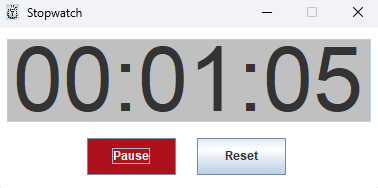

# Stopwatch Application

This is a **Stopwatch** project developed in Java using **Swing**. The application provides a simple and user-friendly stopwatch interface with start, pause, and reset functionalities.

---

## Features
- **Start/Pause**: Start and pause the stopwatch with a single button.
- **Reset**: Reset the stopwatch back to `00:00:00`.
- **Time Display**: Displays elapsed time in `HH:MM:SS` format.
- **Custom Icon**: Includes a custom application icon.
- **Simple UI**: Clean and intuitive user interface.

---

## How to Run the Project
1. Clone the repository
2. Import the project into your favorite IDE (IntelliJ, Eclipse, NetBeans).
3. Compile and run the main file `Stopwatch.java`.

---

## Example Usage
- **Start the Stopwatch**:
   - Click the `Start` button to begin counting time.

- **Pause the Stopwatch**:
   - Click the `Pause` button to stop the timer temporarily.

- **Reset the Stopwatch**:
   - Click the `Reset` button to reset the stopwatch to `00:00:00`.
